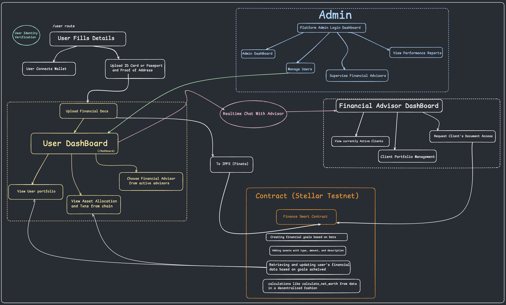

# StellarFinance

StellarFinance is a decentralized financial advisory platform built on the Stellar blockchain. It connects users with verified financial advisors, enabling secure portfolio management, real-time Chat communication, and transparent financial services.




## Problem Solved by StellarFinance
StellarFinance addresses the inefficiencies, trust issues, and accessibility problems in traditional financial advisory services by leveraging blockchain technology. The key problems it solves are:

Many financial advisors operate in opaque environments, and users often struggle to verify their credibility.
StellarFinance enables direct client-advisor interactions with lower transaction costs and no middlemen.
Solution: StellarFinance uses Soroban smart contracts to verify advisor credentials, maintain an immutable reputation system, and ensure transparency.

High Fees & Middlemen

Traditional financial advisory services involve intermediaries that increase costs.


Users may fall victim to fraudulent advisors or mismanaged funds.

Solution: Smart contracts enforce service agreements, secure payments through escrow, and ensure advisors deliver services before receiving payment.


## 🌟 Features

### For Users
- **Portfolio Management**: Track and manage your investments
- **Advisor Connections**: Connect with verified financial professionals
- **Real-time Chat**: Communicate directly with your financial advisors
- **Wallet Integration**: Seamless integration with Stellar blockchain via Freighter wallet
- **Dashboard Analytics**: Visual representation of portfolio performance and asset allocation

### For Advisors
- **Client Management**: Comprehensive overview of all clients and their portfolios
- **Performance Metrics**: Track AUM (Assets Under Management) and client satisfaction
- **Communication Tools**: Real-time chat with clients
- **Task Management**: Schedule and track meetings and portfolio reviews
- **Professional Profile**: Showcase certifications, specializations, and experience

### For Administrator
- **User Management**: Comprehensive tools to manage users and advisors
- **Platform Metrics**: Track total users, active advisors, total AUM, and platform revenue
- **Security Controls**: KYC verification and status management
- **System Monitoring**: Platform health and performance monitoring

## 🚀 Technology Stack

- **Frontend**: React, TypeScript, TailwindCSS
- **Blockchain**: Stellar Network
- **Smart Contracts**: Soroban (Stellar's smart contract platform)
- **Wallet Integration**: Freighter API (`@stellar/freighter-api`)
- **Build Tools**: Vite
- **Deployment**: Vercel

## 💡 Stellar Soroban Smart Contract Integration

StellarFinance is built on Soroban, Stellar's smart contract platform. Our smart contracts handle several critical functions:

1. **Advisor Verification**: Validates advisor credentials and stores reputation data on-chain
2. **Secure Payments**: Manages payment escrow between clients and advisors
3. **Service Agreements**: Creates and enforces agreement terms between users and advisors
4. **Reputation System**: Maintains a transparent, immutable record of advisor ratings and reviews
5. **Portfolio Management**: Provides secure, permissioned access to user portfolio data

The smart contracts ensure transparency, security, and trust within the platform while leveraging Soroban's performance advantages, including high throughput, low transaction costs, and energy efficiency.

## 📋 Prerequisites

- Node.js (v16.x or higher)
- npm (v8.x or higher)
- Freighter Wallet browser extension installed ([Get Freighter](https://www.freighter.app/))

## 🛠️ Installation & Setup

### 1. Clone the repository

```bash
git clone https://github.com/yourusername/StellarFinance.git
cd StellarFinance
```

### 2. Install Soroban CLI and Deploy to Stellar network
```
cargo install soroban-cli

stellar contract deploy \
  --wasm target/wasm32-unknown-unknown/release/contract-stellar-finance.wasm \
  --source <SOURCE_ACCOUNT> \
  --network testnet
```

### 3. Install dependencies

```bash
npm install
```


### 4. Run the development server

```bash
npm run dev
```


### 5. Build for production

```bash
npm run build
```

## 🚢 Deployment

StellarFinance can be deployed to Vercel with minimal configuration:

1. Push your code to a GitHub repository
2. Import the project in Vercel Dashboard
3. Configure the build settings:
   - Build Command: `npm run build`
   - Output Directory: `dist`
   - Framework Preset: Vite
4. Deploy

### Wallet Connection

StellarFinance uses the Freighter wallet API for Stellar blockchain integration. The wallet connection component is located at `src/components/walletConnect.tsx`.

## 📁 Project Structure

```
StellarFinance/
├── contracts/         # Soroban smart contract integration
├── public/                # Static assets
├── src/
│   ├── components/        # Reusable UI components
│   │   ├── Chat.tsx       # Chat interface component
│   │   └── walletConnect.tsx  # Stellar wallet integration
│   ├── pages/             # Application pages
│   │   ├── Dashboard.tsx  # User dashboard
│   │   ├── AdvisorDashboard.tsx  # Advisor interface
│   │   └── AdminDashboard.tsx  # Admin controls
│   ├── config/            # Configuration files

│   ├── main.tsx           # Application entry point
│   └── index.css          # Global styles
├── vercel.json            # Vercel deployment configuration
├── vite.config.ts         # Vite configuration
├── tsconfig.json          # TypeScript configuration
└── package.json           # Project dependencies
```

## 💼 Use Cases

1. **Individual Investors**:
   - Connect their Stellar wallet
   - Browse and connect with financial advisors
   - Receive personalized financial advice
   - Monitor portfolio performance

2. **Financial Advisors**:
   - Showcase expertise and certifications
   - Manage client relationships
   - Provide financial guidance
   - Track performance metrics

3. **Administrators**:
   - Oversee platform operations
   - Manage user accounts and advisor verification
   - Monitor platform metrics and revenue


## 📄 License

This project is licensed under the MIT License - see the LICENSE file for details.

